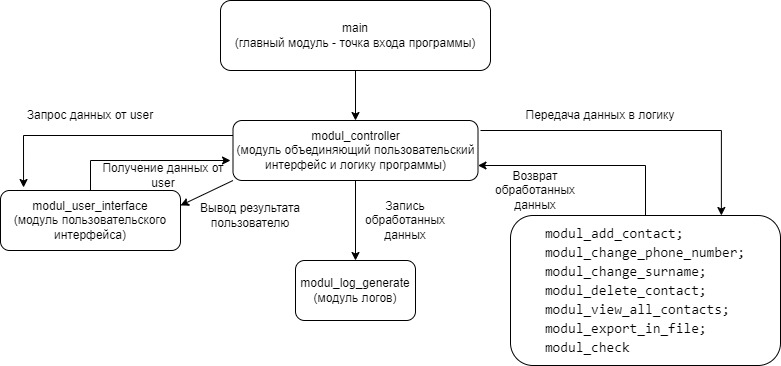

# Seminar_7

## task_calculator
 **Задача:** Создать калькулятор для работы с рациональными и
 комплексными числами, организовать меню, добавив в неё систему логирования.
 В рамках этого обсуждения студентам надо нарисовать “архитектуру”
 (например, в виде блок-схемы) для работы данного приложения.
### Архитектура программы

# Homework(Seminar_7)

## homework_phonebook
Задание в группах(можно симулировать работу в группах): Создать телефонный справочник с возможностью 
импорта и экспорта данных в нескольких форматах.

Реализована возможность импорта в формате json и экспорта в формате txt.
### Архитектура программы

